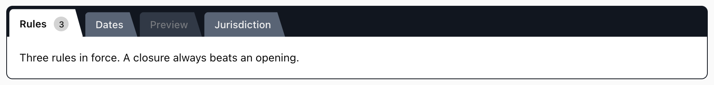

# spcaeo/ui

[](https://github.com/spcaeo/ui/actions/workflows/ci.yml)
[](LICENSE)
[](https://spcaeo.github.io/ui/)
[](https://www.spaceo.ca)

UI components built to a measured bar.

Most component libraries ask you to trust that the colours are accessible. These
ones **compute it from the stylesheet on every commit** and fail the build if a
number moves. Every behavioural promise has a browser test behind it. No build
step for the components themselves.

## Components

|                                                                              | Component                                  | What it is                                                                                                                      |
| ---------------------------------------------------------------------------- | ------------------------------------------ | ------------------------------------------------------------------------------------------------------------------------------- |
| [](components/folder-tabs/) | **[Folder Tabs](components/folder-tabs/)** | A tab control where the active tab **is** the panel, not a highlighted button. Rebuilt from the Visual Basic 4 `SSTab` control. |

More are coming. The tooling is component-agnostic — see
[Adding a component](CONTRIBUTING.md#adding-a-component).

## The bar

Every component here meets all of it. These are not aspirations, they are
enforced:

- **Contrast is computed, not eyeballed.** `npm run contrast` parses each
  component's stylesheet, measures every pair, and regenerates the tables its
  README and docs page publish. CI fails if a ratio drops or a table drifts.
- **State survives greyscale.** Shape and fill identity carry state. A hue alone
  never does — that fails on a bad monitor, a mono print, and for a colourblind
  user all at once.
- **Boundaries may be carried by fill _or_ by a measured stroke.** That either/or
  is not a loophole; it is the only way a genuinely dark theme can satisfy WCAG
  1.4.11 at all. See [the maths](HANDOVER.md#the-wcag-dark-mode-ceiling).
- **Full keyboard and ARIA, or it does not ship.** Roving tabindex, arrow keys,
  Home/End, correct roles and id pairing, and focus that is never moved somewhere
  invisible.
- **`prefers-reduced-motion`, `forced-colors` and print are handled.**
- **One dependency, declared.** A framework build may take at most one, and the
  README must name it. Undeclared imports are a bug.
- **Demos work from `file://`.** A demo that needs a web server gets reported as
  a bug.

## Layout

```
components/<name>/     one self-contained component
  component.json         the manifest the shared tooling reads
  <name>.css             the control
  react/ vanilla/        the two builds
  demo.html              works when double-clicked
  test.mjs               its behavioural tests
tools/                 shared, component-agnostic tooling
  contrast.mjs           measure + generate the published tables
  build-demo.mjs         inline the vanilla source into the demo
  smoke-test.mjs         the browser test runner
  lib/                   colour maths + component discovery
docs/                  one VitePress site for every component
HANDOVER.md            full context: decisions, gotchas, recipes
```

## Commands

Every tool takes an optional component name, so you can work on one without
paying for the others.

```bash
npm install

npm run contrast                # measure every component
npm run contrast folder-tabs    # just one
npm run contrast -- --sync      # regenerate the published tables
npm run contrast -- --check     # verify ratios AND tables (this is CI)

npm test                        # behavioural tests, all components
npm test folder-tabs            # just one
npm run build:demo              # re-inline vanilla sources into demos
npm run screenshots             # recapture every declared shot
npm run check                   # everything CI runs
npm run docs:dev                # the documentation site
```

## Documentation

**[spcaeo.github.io/ui](https://spcaeo.github.io/ui/)**

## Who builds this

Built and maintained by **[Space-O Technologies](https://www.spaceo.ca)** — a
software company founded in 2010, with 250+ engineers and 3,000+ delivered
projects, including [Glovo](https://glovoapp.com/).

- Canada — **[www.spaceo.ca](https://www.spaceo.ca)**
- Global — [spaceotechnologies.com](https://www.spaceotechnologies.com/)
- AI — [spaceo.ai](https://spaceo.ai/)

## Licence

MIT. Take it.
