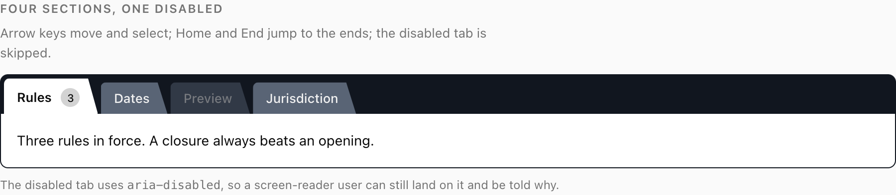
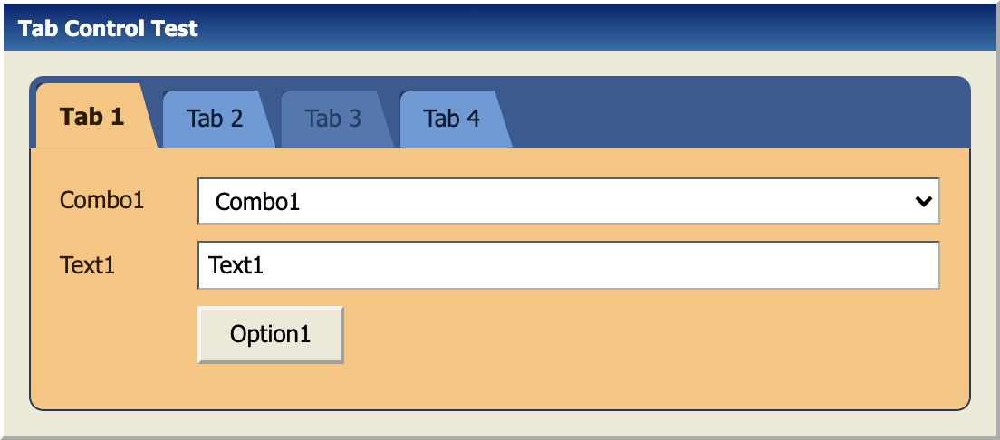
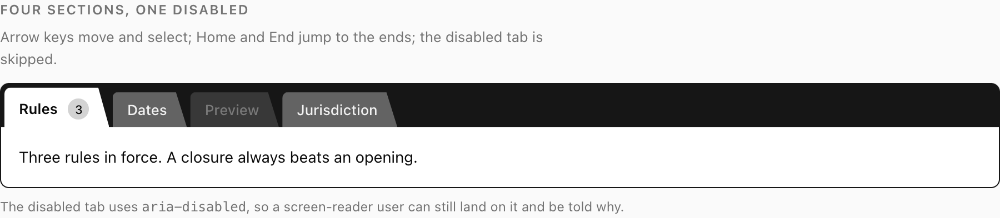
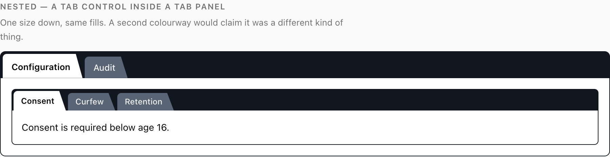
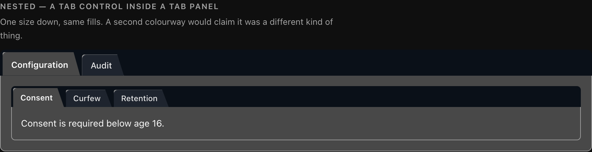
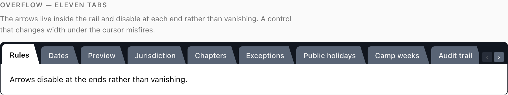
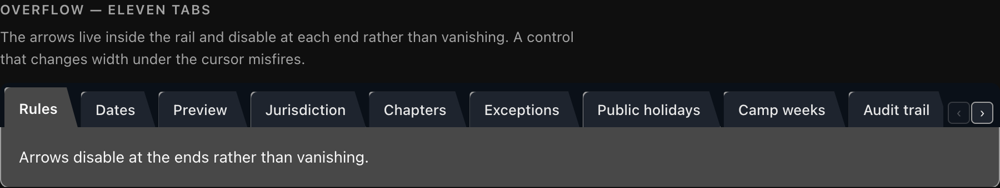

# VB-Inspired Folder Tabs

[](https://github.com/spcaeo/vb-inspired-folder-tabs/actions/workflows/ci.yml)
[](LICENSE)
[](package.json)
[](https://spcaeo.github.io/vb-inspired-folder-tabs/)

A tab control where **the active tab is the panel**, not a highlighted button.
Rebuilt from the Visual Basic 4 `SSTab` control.

No build step, no Tailwind, no design system. A React build, a dependency-free
vanilla build, and one stylesheet between them.



```bash
git clone https://github.com/spcaeo/vb-inspired-folder-tabs.git
open vb-inspired-folder-tabs/demo.html
```

---

## Where it comes from

Windows 3.1 and Visual Basic 4 solved tabs properly and then the web spent
thirty years forgetting how. The `SSTab` control did not tint the selected tab —
it made the selected tab _the same sheet of paper as the panel_, cut as a real
trapezoid, standing proud of a darker rail.

This is that control, rebuilt. The screenshot below is **not** the original: it
is this stylesheet with its six colour variables set to the original's colourway,
which is the whole retheming surface.



## The mechanic

This is the whole idea, and everything else is detail:

> **Three fills in a fixed relationship.** The rail is darkest. An inactive tab
> sits above it. The active tab is _exactly the panel's fill_.

That identity is what makes tab and panel read as one sheet of paper. The active
tab is not marked — it _is_ the panel, continuing upward.

Two things follow, and both matter:

**It survives greyscale.** Shape and shared fill carry the state, so it still
reads on a black-and-white print, for a colourblind user, or on a bad monitor. A
tint alone does none of that. Here is the same control with every hue removed —
you can still tell instantly which tab is selected:



**The panel must exist.** Give the panel a different ground, or remove it, and
the join disappears. The first version of this control had the active tab white
on a white page and no panel border — it read as a floating outline, and it took
a screenshot to notice.

## Light and dark

| Light                                           | Dark                                           |
| ----------------------------------------------- | ---------------------------------------------- |
|    |    |
|  |  |

### Getting it wrong in dark mode

The easiest mistake:

> The active tab must stay the **lightest** of the three, because it is the
> panel. If your dark-mode panel token is darker than your tab fill, the selected
> tab reads as _pressed in_ and the unselected ones read as raised. Exactly
> backwards.

Dark mode has less usable range below "a panel you can read", which is why
`--tab-panel` is its own variable here rather than borrowing a card colour.

## Contrast

Measured on the actual values in `folder-tabs.css` by `npm run contrast`, which
parses the stylesheet — so these numbers cannot drift from the code. WCAG asks
**4.5** for a label and **3.0** for a boundary.

|                            | light             | dark                            |
| -------------------------- | ----------------- | ------------------------------- |
| label on inactive tab      | **5.34**          | **12.64**                       |
| label on active tab        | **19.79**         | **8.82**                        |
| focus ring on inactive tab | **5.66**          | **13.43**                       |
| focus ring on active tab   | **13.64**         | **7.96**                        |
| inactive tab vs rail       | **3.02** by fill  | 1.23 by fill — **5.82** by edge |
| active tab vs rail         | **18.11** by fill | 2.08 by fill — **3.45** by edge |
| active tab vs inactive tab | **6.00** by fill  | 1.69 by fill — **3.45** by edge |

**Why dark mode carries its boundaries on a stroke.** Three genuinely dark fills
_cannot_ all sit 3:1 apart. WCAG 2.x adds a flat `0.05` flare term to both sides
of the ratio, and near black that term dominates: a `#333` panel cannot reach 3:1
against a rail even if that rail is pure black — the ceiling is **1.66**. The
only way to pass on fill alone is to push the panel up to about `#5d5d5d`, at
which point it is not a dark mode any more.

So dark mode does what the original control did: it draws a border.
`--tab-edge` is measured against every surface it touches, and `npm run contrast`
enforces the rule that **each boundary must clear 3.0 by fill _or_ by edge**.

These numbers are a **set**. Lift the tab fill for a clearer edge and the label
drops under 4.5; darken it for the label and the edge disappears. Change one,
run `npm run contrast`, and fix what it tells you.

## Install

There is no npm package yet — copy the files in.

**CSS only** — bring your own markup and state:

```html
<link rel="stylesheet" href="folder-tabs.css" />
```

**Vanilla**, no dependencies:

```html
<link rel="stylesheet" href="folder-tabs.css" />
<script type="module">
  import { initFolderTabs } from "./vanilla/folder-tabs.js";
  initFolderTabs(); // scans for [data-folder-tabs]
</script>
```

Markup is documented at the top of `vanilla/folder-tabs.js`. `initFolderTabs`
is idempotent and returns a teardown function.

**React** — needs `@radix-ui/react-tabs` and nothing else:

```bash
npm install @radix-ui/react-tabs
```

```tsx
import "./folder-tabs.css";
import {
  FolderTabs,
  FolderTabsRail,
  FolderTab,
  FolderTabsPanel,
  FolderTabCount,
} from "./react/folder-tabs";

<FolderTabs value={tab} onValueChange={setTab}>
  <FolderTabsRail aria-label="Sections">
    <FolderTab value="rules">
      Rules <FolderTabCount>3</FolderTabCount>
    </FolderTab>
    <FolderTab value="dates">Dates</FolderTab>
    <FolderTab value="preview" disabled>
      Preview
    </FolderTab>
  </FolderTabsRail>

  <FolderTabsPanel value="rules">…</FolderTabsPanel>
  <FolderTabsPanel value="dates" flush>
    …a grid, which brings its own padding…
  </FolderTabsPanel>
</FolderTabs>;
```

Radix gives roving focus, arrow keys, Home/End, `aria-controls` pairing and the
disabled-tab skip. No Tailwind, no icon library, no `cn` helper.

## Theming

Six variables, and nothing else:

```css
:root {
  --tab-rail: oklch(0.2 0.02 260); /* the band the tabs stand on */
  --tab-rail-fill: oklch(0.5 0.03 260); /* an inactive tab */
  --tab-rail-ink: oklch(0.96 0 0); /* its label */
  --tab-panel: oklch(1 0 0); /* the panel AND the active tab */
  --tab-panel-ink: oklch(0.145 0 0);
  --tab-edge: oklch(0.2 0.02 260); /* the stroke that carries boundaries */
}
```

Dark mode applies under `.dark`, `[data-theme="dark"]`, or the OS setting via
`prefers-color-scheme` — an explicit `.light` still wins. There is an sRGB
fallback for anything too old for `oklch`.

## Details worth keeping

- **Tabs do not overlap.** An earlier version pulled each 6px under its
  neighbour to tuck like a card index. With every inactive tab on one fill that
  is a single block with notches in it. The rail showing through a 3px gap is
  what separates them.
- **Arrows live inside the rail** and **disable** at each end rather than
  disappearing. A control that changes width under the cursor misfires.
- **Focus is pulled back into view** by moving the strip's own `scrollLeft`, and
  focus is taken with `preventScroll`. The obvious `scrollIntoView` scrolls every
  scrollable ancestor including the document, so arrow-keying a tab strip would
  drag the whole page.
- **Arrows are `tabindex="-1"`.** They are scroll controls, not tabs.
- **`aria-disabled` as well as `disabled`.** The first keeps the tab focusable so
  a screen-reader user can find it and be told why it is unavailable, which is
  what WAI-ARIA asks for. Both are skipped by the arrow keys and both look the same.
- **`flush` keeps the walls.** It tightens padding for content that brings its own
  card. Dropping the walls too leaves the rail floating above nothing.

## Layout

```
folder-tabs.css          the control. Start here — it is the real asset.
react/folder-tabs.tsx    React, on Radix Tabs
vanilla/folder-tabs.js   no framework, no dependencies
demo.html                working example: nesting, overflow, disabled, flush, dark
docs/                    the documentation site (VitePress)
tools/contrast.mjs       re-measures contrast from the stylesheet itself
tools/build-demo.mjs     inlines the vanilla source into demo.html
tools/smoke-test.mjs     behavioural tests in a real browser
```

## Scripts

```bash
npm run contrast      # re-measure every ratio from folder-tabs.css
npm test              # 20 behavioural tests in headless Chromium
npm run build:demo    # re-inline vanilla/folder-tabs.js into demo.html
npm run check         # everything CI runs
npm run docs:dev      # the documentation site
```

`demo.html` inlines the vanilla source so it works when opened straight from a
file manager — `file://` refuses ES module imports on CORS grounds. It is
generated, never hand-edited, and CI fails if the two drift.

## Documentation

Full docs at **[spcaeo.github.io/vb-inspired-folder-tabs](https://spcaeo.github.io/vb-inspired-folder-tabs/)** —
the mechanic, theming, accessibility, nesting, overflow, and the complete CSS,
React and vanilla APIs.

## Contributing

See [CONTRIBUTING.md](CONTRIBUTING.md). One hard rule: the six fills are a
measured set. If you change one, run `npm run contrast` and fix everything it
reports before opening a PR.

## Licence

MIT. Take it.
