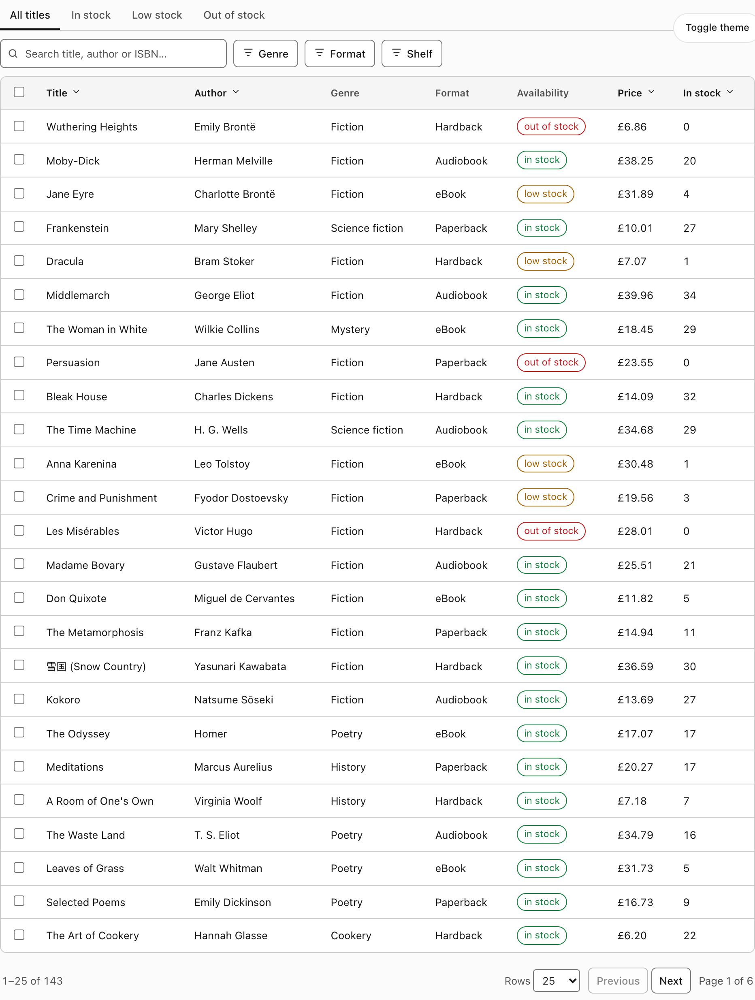
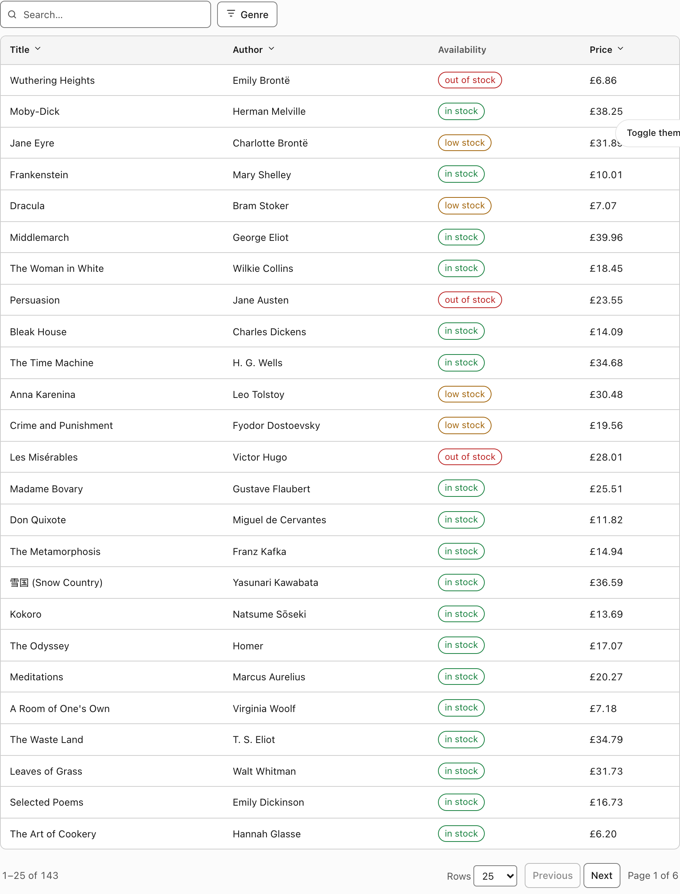
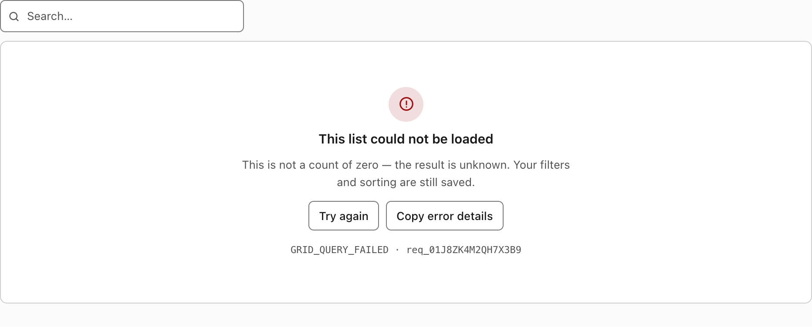
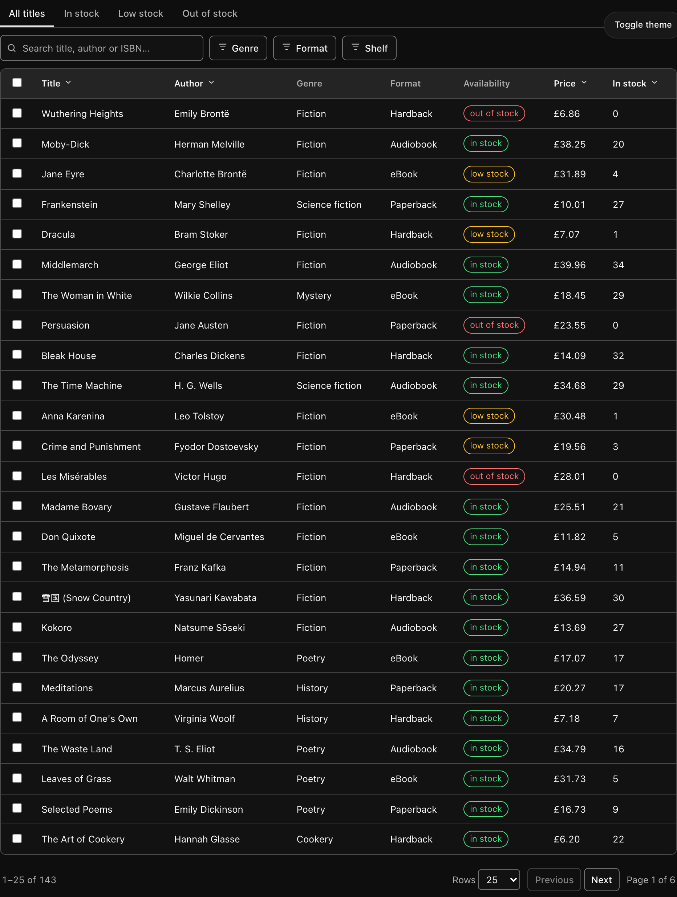

# Data Grid

[](../../LICENSE)
[](#dependencies)
[](https://spcaeo.github.io/ui/)

A listing grid whose **entire state lives in the URL**. Search, filter, sort,
page, segment and display mode are all in the address bar, so any view can be
shared, bookmarked, reloaded, and reached by Back.

There are many good React tables. Almost none of them can be linked to.



```bash
git clone https://github.com/spcaeo/ui.git
open ui/components/data-grid/demo.html      # works straight from the filesystem
```

---

## Why this one

**The URL is the state.** Change anything and the address bar updates. Copy it
into a new tab and you land on exactly that view — same search, same filters,
same sort, same page.

```
/books?bk_q=bront%C3%AB&bk_fx=1.WyJhbmQiLFtb...&bk_sort=price:desc&bk_page=2
```

Defaults are omitted, so an untouched grid has a **clean URL**. Every parameter
written down becomes part of your product's public navigation API — it ends up
in bookmarks, tickets and emails — and each one is a commitment to keep
supporting. Writing `page=1&size=25&view=table` on a fresh grid commits you to
three parameters that carry no information.

**It will not duplicate your design system.** The grid imports nothing from your
app, so it cannot collide with your Button, your Dialog, or your version of
anything. It themes itself from CSS variables that read your host tokens if they
exist and fall back to its own if they do not:

```css
--dg-bg: var(--background, oklch(1 0 0));
```

Drop it into a shadcn/ui project and it inherits `--background`, `--border`,
`--primary`, `--ring` and the rest automatically. The screenshot below is the
same component, unmodified, inside an element defining shadcn's tokens:



**The states are not interchangeable.**



A failed request is **not a count of zero**, and "nothing matched your filter" is
not "nothing exists". Collapsing those into one "No results" card tells people
their data is gone when the truth is that a request failed — and it is the most
common grid bug there is. This ships seven distinct states: loading, refreshing,
empty, no-match, error, offline and stale.

Every error carries a **stable code and a request id**, and offers **Copy error
details** — deliberately narrow: a code, an id, a page, a timestamp. No tokens,
no row data, no stack traces.

## Dependencies

**Zero.** Not "zero after you install a peer" — zero.

Popovers use the native [`popover` attribute][pop] and dialogs use `<dialog>`.
No Radix, no Tailwind, no TanStack, no icon library, no `cn` helper, no build
step. The React build adds React and nothing else.

[pop]: https://developer.mozilla.org/en-US/docs/Web/API/Popover_API

## Install

Copy the files in. There is no npm package yet.

**Vanilla** — the whole thing in two files plus the stylesheet:

```html
<link rel="stylesheet" href="data-grid.css">
<script type="module">
  import { createDataGrid } from "./vanilla/data-grid.js";

  createDataGrid(document.querySelector("#books"), {
    namespace: "bk",                       // URL prefix: bk_q, bk_page, bk_sort
    columns: [
      { id: "title",  label: "Title",  sortable: true },
      { id: "author", label: "Author", sortable: true },
      { id: "price",  label: "Price",  align: "right", sortable: true,
        render: (row) => `£${row.price.toFixed(2)}` },
    ],
    filters: [{ id: "genre", label: "Genre", type: "enum", options: GENRES }],
    segments: [{ id: "all", label: "All" }, { id: "in stock", label: "In stock" }],
    selectable: true,
    async load(query, signal) {
      const res = await fetch(`/api/books?${query.searchParams}`, { signal });
      if (!res.ok) throw await gridError(res);
      return res.json();                   // { rows, total }
    },
  });
```

`query.searchParams` is the same serialisation the browser URL uses, so your
server reads one vocabulary and a deep link and an API call cannot disagree.

**Core only** — take just the URL contract and render your own table:

```js
import { readGridParams, writeGridParams, applyChange } from "./core/url-state.mjs";
```

The core is framework-agnostic and router-agnostic: it takes and returns
`URLSearchParams` and knows nothing about Next.js, React Router, or the History
API. The same functions run on a server reading an incoming request, which is
what stops the client and server disagreeing about what `page=0` means.

## The URL contract

Parameters are `<namespace>_<suffix>`, so two grids can share one route.

| Suffix  | Holds                  | Omitted when |
| ------- | ---------------------- | ------------ |
| `_q`    | search text            | empty        |
| `_seg`  | segment id             | unset        |
| `_fx`   | encoded filter model   | no filters   |
| `_sort` | `field:dir,field2:dir` | unsorted     |
| `_page` | one-based page         | page 1       |
| `_size` | page size              | default      |
| `_view` | `table` or `cards`     | `table`      |
| `_sel`  | open row, by stable id | closed       |

**Rules the core enforces for you:**

- **Validate everything.** A URL is untrusted input. A negative page clamps, an
  unknown sort field is dropped, a malformed filter is ignored — the grid never
  crashes on a stale bookmark.
- **Report what was dropped.** If a shared link names filters that no longer
  exist, the grid _says so_. Silently showing an unfiltered view means the
  recipient sees different data than the sender and neither of them knows.
- **Reset in one place.** Changing the result set returns to page 1; changing
  the predicate drops an all-matching selection. These live in `applyChange`,
  not as `delete("page")` calls scattered through your features.
- **Push versus replace.** Paging pushes history; typing replaces it. Otherwise
  Back has to be pressed once per keystroke to escape the grid.
- **Reset touches only your namespace.** Another grid's state, and the rest of
  the query string, are left alone.

## Accessibility

Semantic `<table>` markup; sortable headers are real buttons carrying
`aria-sort`; checkboxes have unique labels; result counts are announced through
a live region; focus is always visible. `prefers-reduced-motion`,
`forced-colors` and print are all handled.

## Contrast

Measured from `data-grid.css` by `npm run contrast data-grid`, which parses the
stylesheet — these numbers cannot drift from the code.

<!-- CONTRAST:START -->
<!-- Generated by `npm run contrast -- --sync`. Do not edit by hand. -->

|                               | light         | dark          | needs |
| ----------------------------- | ------------- | ------------- | ----- |
| body text on background       | **17.72**     | **17.75**     | 4.5   |
| muted text on background      | **7.77**      | **8.45**      | 4.5   |
| column header on header fill  | **7.12**      | **6.98**      | 4.5   |
| primary button label          | **17.22**     | **14.29**     | 4.5   |
| error text on background      | **8.48**      | **6.53**      | 4.5   |
| focus ring on background      | **7.44**      | **7.58**      | 3.0   |
| focus ring on header fill     | **6.82**      | **6.26**      | 3.0   |
| control border vs background  | 4.28 by fill  | 3.88 by fill  | 3.0   |
| control border vs header fill | 3.93 by fill  | 3.20 by fill  | 3.0   |
| primary button vs background  | 17.72 by fill | 14.84 by fill | 3.0   |

<sub>Text needs 4.5:1 (WCAG 1.4.3); boundaries need 3:1 (WCAG 1.4.11).</sub>
<!-- CONTRAST:END -->

**These measure the fallback palette**, which is what a standalone page renders.
When you inherit a host theme, the host owns the contrast — we cannot measure
colours we do not define, and claiming otherwise would be exactly the unverified
assertion this collection exists to avoid.

## Dark mode



Applies under `.dark`, `[data-theme="dark"]`, or the OS setting via
`prefers-color-scheme` — an explicit `.light` still wins.

## Layout

```
components/data-grid/
  core/                zero-dep, framework-agnostic, runs on a server too
    query.mjs            defaults, normalisation, reset and history rules
    filter-model.mjs     typed filters, URL-safe encoding, validation
    url-state.mjs        read/write params, omit defaults, namespace reset
  vanilla/data-grid.js the grid, no framework
  react/data-grid.tsx  the same grid for React
  data-grid.css        one stylesheet, host-theme aware
  demo.html            a bookshop stock list; works from file://
  core.test.mjs        28 contract tests, no browser needed
  test.mjs             30 behavioural tests in a real browser
```

## Tests

```bash
npm test data-grid          # 58 tests: 28 contract + 30 behavioural
npm run contrast data-grid  # re-measure every ratio
```

## Who builds this

Built and maintained by **[Space-O Technologies](https://www.spaceo.ca)**.
Part of the [spcaeo/ui](https://github.com/spcaeo/ui) collection.

## Licence

MIT. Take it.
